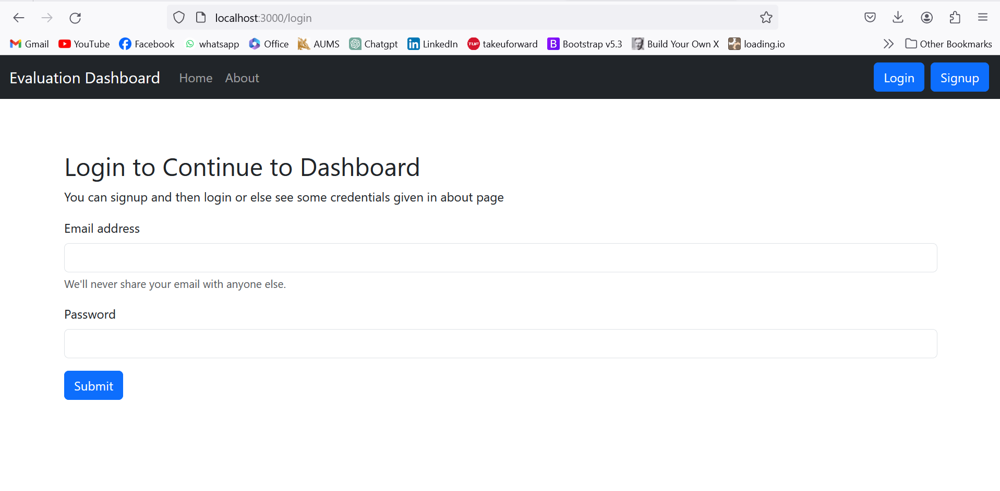

# Evaluation Dashboard System 🧑‍💻
> This Evaluation Dashboard project is designed to provide a platform for mentors to manage student evaluations securely and efficiently. Mentors can either log in using their credentials or sign up if they are new users. Once authenticated, mentors can add students to their dashboard and assign marks based on project criteria such as ideation, execution, presentation, communication, and viva. The system ensures privacy by allowing each mentor to view and evaluate only their own students, maintaining confidentiality and fairness. The dashboard also calculates the total marks obtained by each student automatically, providing mentors with comprehensive insights into student performance. Overall, the project streamlines the evaluation process while prioritizing data security and user authentication for a seamless user experience.

## Table of Contents
* [What it does ⚙️](#what_it_does)
* [How I built it 🛠️](#built)
* [Challenges I ran into 😓](#challenges)
* [Accomplishments that I am proud of 🏅](#accomplishments)
* [What I learned 🎓](#learning)
* [What's next for Evaluation Dashboard 🔜](#what-next)
* [Screenshots 🖼️](#screenshots)
* [Contact 📩](#contact)

## What it does ⚙️
The Evaluation Dashboard View project provides a platform for mentors to manage student evaluations securely and efficiently. Mentors can log in using their credentials or sign up as new users. Once authenticated, mentors can add students to their dashboard and assign marks based on project criteria such as ideation, execution, presentation, communication, and viva. The system automatically calculates the total marks obtained by each student, providing comprehensive insights into student performance.

## How we built it 🛠️
- I built the Evaluation Dashboard View project using a combination of frontend and backend technologies. The frontend was developed using HTML, CSS, and JavaScript, providing a user-friendly interface for mentors to interact with.
- For the backend, I used technologies like Node.js and Express.js to handle user authentication, data storage, and calculations for total marks. I also integrated a database system such as MongoDB to store student and evaluation data securely.

## Challenges I ran into 😓
One of the major challenges I encountered was deploying the application and connecting the frontend with the backend seamlessly. This required configuring server settings, managing dependencies, and resolving compatibility issues between different technologies. However, I was only able to deploy the server side but frontend part got some disfunctionalities.

## Accomplishments that I am proud of 🏅
I am proud of creating a functional and secure platform that meets the needs of mentors for managing student evaluations. Our system not only facilitates the evaluation process but also ensures data privacy and confidentiality, which are crucial aspects of educational platforms. Additionally, I am proud of collaboration and problem-solving skills that enabled me to tackle challenges effectively.

## What I learned 🎓
Through this project, I gained valuable experience in full-stack web development, including frontend design, backend development, database management, and deployment processes. I learned how to integrate user authentication, handle data securely, and create a responsive and intuitive user interface. These skills are essential in building robust and user-friendly web applications.

## What's next for Evaluation Dashboard 🔜
In the future, I plan to enhance the Evaluation Dashboard View project by adding more features such as real-time notifications for mentors and students, data analytics tools for performance analysis, and collaboration features. I also aim to optimize the application for scalability and performance to accommodate a larger user base and handle increased data volumes effectively. Overall, I am committed to continuously improving the platform to provide an exceptional user experience for mentors and students alike.

## Screenshots 🖼️

## Contact 📩
Created by: [@arunkumarsah](https://www.linkedin.com/in/arunsah10/)
